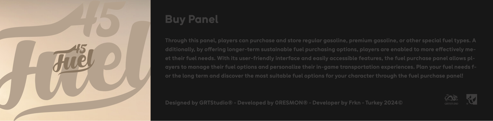

Your driving experience in <a href="https://fivem.net/" style="color: #FFDB6E;">Fivem</a> just got more exciting and eco-friendly! With the newly developed <b>gas station script</b>, you now have more options to fulfill your fuel needs in the city. Offering both traditional gasoline refueling for your conventional vehicles and charging stations for your electric vehicles, these modern stations are now at your service. This innovative script is designed for players in the Fivem community. It provides specialized charging stations for electric vehicles and fast fueling points for traditional gasoline vehicles, making it easier for you to manage urban traffic in a more eco-friendly way. ✨

<ul>
  <li><a href="https://www.behance.net/gallery/196652591/Fivem-Fuel-Station-x-Frkn"><b>Behance (1K+ Views)</b></a> <i>up to 2024</i></li>
  <li><a href="https://0resmon.tebex.io/"><b>TebexStore (500+ Sales)</b></a> <i>up to 2024</i></li>
  <li><a href=""><b>Youtube (10K+ Views)</b></a> <i>up to 2024</i></li>
</ul>

  

     

 